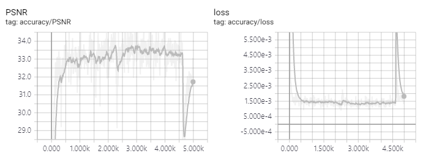

# srcnn-rnn
* SRCNN with Vanilla RNN tensorflow implementation
* Hanyang University ITE4053 Deep Learning Methods and Applications assignment #2

## Requirements
* Python 3.6
* TensorFlow 1.12
* NumPy
* imageio
* Pillow

## Assignment detail
* 32x32x1 input
* 32x32x1 output
* 3x3 kernel
* number of epoch=5000
* mini batch size=128
* Recurrent structure (Vanilla RNN)

## Trained models
### Model A
* Downscaling interpolation to half size (preprocess): AREA
* ADAM optimizer setting: learning rate=0.003, β1=0.9, β2=0.999, ε=1E−08

### Model B
* Downscaling interpolation (preprocess): NEAREST_NEIGHBOR
* ADAM optimizer setting: learning rate=0.0001, β1=0.9, β2=0.999, ε=1E−08

### Model C
* Downscaling interpolation (preprocess): BICUBIC
* ADAM optimizer setting: learning rate=0.0001, β1=0.9, β2=0.999, ε=1E−08

## Result (Model A)
### Low-resolution (BICUBIC)


### SRCNN-RNN result


### Metrics (but something wrong...)


## References
* Original paper
    * [Image Super-Resolution Using Deep Convolutional Networks](https://arxiv.org/abs/1501.00092)
    * [Deep Learning for Single Image Super-Resolution: A Brief Review](https://arxiv.org/abs/1808.03344)
* My program architecture is inspired by some good tutorials and examples
    * https://github.com/cs230-stanford/cs230-code-examples
    * https://cs230-stanford.github.io/tensorflow-input-data.html
    * https://www.tensorflow.org/guide/datasets
    * https://docs.python-guide.org/writing/structure/

## Problems and solutions
### Python 3.7, TensorFlow 1.13에서 tf.concat 사용시 에러 발생
```
AbortedError (see above for traceback): Operation received an exception:Status: 5, message: could not create a view primitive descriptor, in file tensorflow/core/kernels/mkl_slice_op.cc:435
         [[node gradients/concat_2_grad/Slice_1 (defined at C:\srcnn-rnn\framework\model.py:70) ]]
```
* 모델 구축도 다 잘 되는데 sess.run할때 뜬금없이 tf.concat 관련하여 에러가 발생
* 이미 보고된 버그이지만 비교적 사례가 적은데, 인텔 mkl에 관계된 것으로 보임 https://github.com/tensorflow/tensorflow/issues/17494
* 그런데 또 노트북에서는 잘 돌아감을 확인. AMD CPU 문제?
* 텐서플로우 GPU 버전에서는 확인해보지 않음
* 웹상에 공개된 (아마도) 유일한 해결책은 Python 3.6, Tensorflow 1.12로 버전을 낮추는 것 https://blog.csdn.net/Bing_bing_bing_/article/details/90211188

### TensorBoard 이미지 슬라이더 촘촘하게 만들기
`tensorboard --logdir=logs/ --samples_per_plugin images=100`